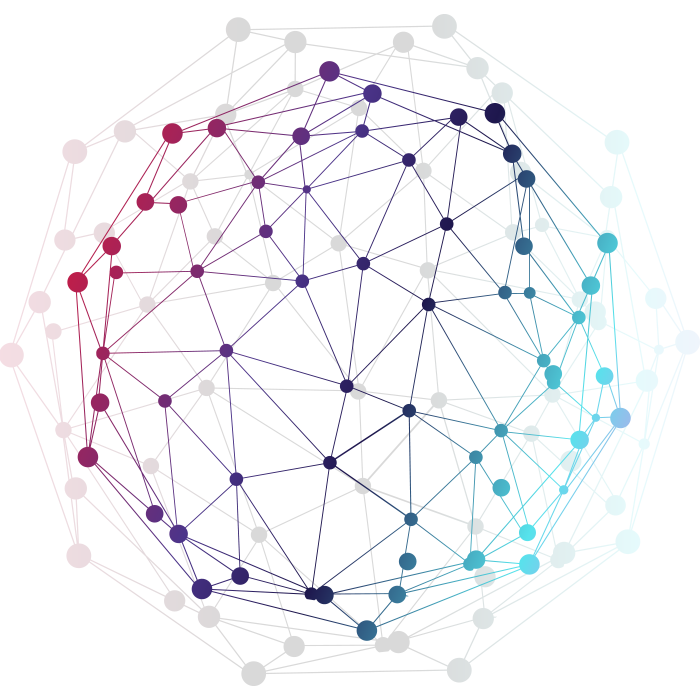

# DSA With Java

Welcome to the **DSA With Java** project! This repository contains a collection of Java programs that demonstrate various data structures and algorithms. Below is a list of the programs included, each addressing a different problem or concept.

## Table of Contents

1. [Count Number of Even and Odd Elements in an Array](#)
2. [Average Numbers in an Array](#)
3. [Print a Given Digit in Words](#)
4. [Check if a Large Number is Divisible by 6](#)
5. [Check if a Number is a Palindrome](#)
6. [Count Vowels in a String](#)
7. [Check if a Number is a Perfect Square](#)
8. [Find the Maximum Element in a Matrix](#)
9. [Sum of the given digit](#)
10. [Sum of n squared number to the given range](#)

---

Feel free to explore each of these programs to enhance your understanding of data structures and algorithms in Java. Happy coding!

---
